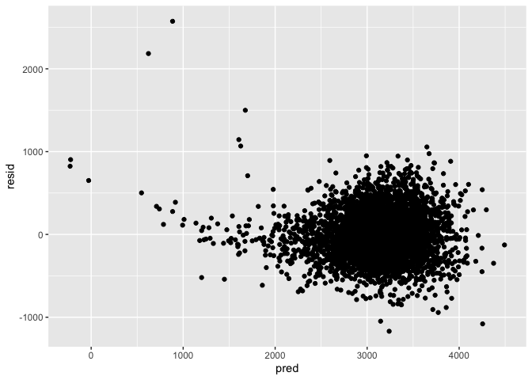

hw6\_jo2570
================
Jai Oberoi
20/11/2019

Load and clean birthweight data:

``` r
bw_data = read_csv("./data/birthweight.csv") %>% 
  janitor::clean_names() %>%
  mutate(babysex = factor(babysex, levels = c("1", "2"), labels = c("male", "female")),
         frace = factor(frace, levels = c("1", "2", "3", "4", "8", "9"), labels = c("white", "black", "asian", "puerto rican", "other", "unknown")),
         malform = factor(malform, levels = c("0", "1"), labels = c("absent", "present")),
         mrace = factor(mrace, levels = c("1", "2", "3", "4", "8"), labels = c("white", "black", "asian", "puerto rican", "other"))
         )
```

    ## Parsed with column specification:
    ## cols(
    ##   .default = col_double()
    ## )

    ## See spec(...) for full column specifications.

Fitting a regression model for birthweight:

We fit a regression model for baby birthweight using the hypothesis that
test how characteristics of the baby affect its birthweight. We fit a
model with the main predictors baby characteristics and adjust for
mother characteristics thay may affect her health and health of the
baby. We want to keep the model parsimonious, ensure no 2 predictor
variables measure the same characteristic and/or are very closely
associated with each
other.

``` r
fit_1 = lm(bwt ~ babysex + bhead + blength + gaweeks + momage + ppbmi + smoken + malform, data = bw_data) 

fit_1 %>% 
  broom::tidy()
```

    ## # A tibble: 9 x 5
    ##   term           estimate std.error statistic   p.value
    ##   <chr>             <dbl>     <dbl>     <dbl>     <dbl>
    ## 1 (Intercept)    -6345.     100.      -63.2   0.       
    ## 2 babysexfemale     33.3      8.81      3.78  1.62e-  4
    ## 3 bhead            139.       3.56     39.0   8.77e-286
    ## 4 blength           81.3      2.08     39.2   2.15e-287
    ## 5 gaweeks           13.8      1.51      9.14  9.58e- 20
    ## 6 momage             6.04     1.13      5.35  9.37e-  8
    ## 7 ppbmi              2.94     1.37      2.15  3.12e-  2
    ## 8 smoken            -2.04     0.588    -3.47  5.32e-  4
    ## 9 malformpresent    44.5     73.6       0.604 5.46e-  1

``` r
fit_1 %>% 
  broom::glance()
```

    ## # A tibble: 1 x 11
    ##   r.squared adj.r.squared sigma statistic p.value    df  logLik    AIC
    ##       <dbl>         <dbl> <dbl>     <dbl>   <dbl> <int>   <dbl>  <dbl>
    ## 1     0.692         0.692  284.     1219.       0     9 -30690. 61400.
    ## # … with 3 more variables: BIC <dbl>, deviance <dbl>, df.residual <int>

For the inclusion criteria for the final model, we recognize variables
that meet the 95% level of significance (p-value \<
0.05)

``` r
fit_final = lm(bwt ~ babysex + bhead + blength + gaweeks + momage + ppbmi + smoken, data = bw_data) 

fit_final %>% 
  broom::tidy()
```

    ## # A tibble: 8 x 5
    ##   term          estimate std.error statistic   p.value
    ##   <chr>            <dbl>     <dbl>     <dbl>     <dbl>
    ## 1 (Intercept)   -6344.     100.       -63.2  0.       
    ## 2 babysexfemale    33.2      8.81       3.77 1.68e-  4
    ## 3 bhead           139.       3.56      39.0  6.37e-286
    ## 4 blength          81.2      2.07      39.2  2.20e-287
    ## 5 gaweeks          13.8      1.51       9.13 9.84e- 20
    ## 6 momage            6.05     1.13       5.36 8.86e-  8
    ## 7 ppbmi             2.94     1.37       2.15 3.13e-  2
    ## 8 smoken           -2.03     0.588     -3.45 5.67e-  4

``` r
fit_final %>% 
  broom::glance()
```

    ## # A tibble: 1 x 11
    ##   r.squared adj.r.squared sigma statistic p.value    df  logLik    AIC
    ##       <dbl>         <dbl> <dbl>     <dbl>   <dbl> <int>   <dbl>  <dbl>
    ## 1     0.692         0.692  284.     1393.       0     8 -30690. 61398.
    ## # … with 3 more variables: BIC <dbl>, deviance <dbl>, df.residual <int>

``` r
modelr::add_residuals(bw_data, fit_final)
```

    ## # A tibble: 4,342 x 21
    ##    babysex bhead blength   bwt delwt fincome frace gaweeks malform menarche
    ##    <fct>   <dbl>   <dbl> <dbl> <dbl>   <dbl> <fct>   <dbl> <fct>      <dbl>
    ##  1 female     34      51  3629   177      35 white    39.9 absent        13
    ##  2 male       34      48  3062   156      65 black    25.9 absent        14
    ##  3 female     36      50  3345   148      85 white    39.9 absent        12
    ##  4 male       34      52  3062   157      55 white    40   absent        14
    ##  5 female     34      52  3374   156       5 white    41.6 absent        13
    ##  6 male       33      52  3374   129      55 white    40.7 absent        12
    ##  7 female     33      46  2523   126      96 black    40.3 absent        14
    ##  8 female     33      49  2778   140       5 white    37.4 absent        12
    ##  9 male       36      52  3515   146      85 white    40.3 absent        11
    ## 10 male       33      50  3459   169      75 black    40.7 absent        12
    ## # … with 4,332 more rows, and 11 more variables: mheight <dbl>,
    ## #   momage <dbl>, mrace <fct>, parity <dbl>, pnumlbw <dbl>, pnumsga <dbl>,
    ## #   ppbmi <dbl>, ppwt <dbl>, smoken <dbl>, wtgain <dbl>, resid <dbl>

``` r
modelr::add_predictions(bw_data, fit_final)
```

    ## # A tibble: 4,342 x 21
    ##    babysex bhead blength   bwt delwt fincome frace gaweeks malform menarche
    ##    <fct>   <dbl>   <dbl> <dbl> <dbl>   <dbl> <fct>   <dbl> <fct>      <dbl>
    ##  1 female     34      51  3629   177      35 white    39.9 absent        13
    ##  2 male       34      48  3062   156      65 black    25.9 absent        14
    ##  3 female     36      50  3345   148      85 white    39.9 absent        12
    ##  4 male       34      52  3062   157      55 white    40   absent        14
    ##  5 female     34      52  3374   156       5 white    41.6 absent        13
    ##  6 male       33      52  3374   129      55 white    40.7 absent        12
    ##  7 female     33      46  2523   126      96 black    40.3 absent        14
    ##  8 female     33      49  2778   140       5 white    37.4 absent        12
    ##  9 male       36      52  3515   146      85 white    40.3 absent        11
    ## 10 male       33      50  3459   169      75 black    40.7 absent        12
    ## # … with 4,332 more rows, and 11 more variables: mheight <dbl>,
    ## #   momage <dbl>, mrace <fct>, parity <dbl>, pnumlbw <dbl>, pnumsga <dbl>,
    ## #   ppbmi <dbl>, ppwt <dbl>, smoken <dbl>, wtgain <dbl>, pred <dbl>

Plotting residuals agaist predticted values based on the model
fit\_final:

``` r
bw_data %>% 
  modelr::add_residuals(fit_final) %>% 
  modelr::add_predictions(fit_final) %>% 
  ggplot(aes(x = pred , y = resid)) + geom_point()
```

<!-- -->
