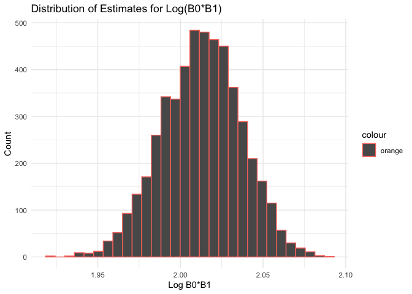
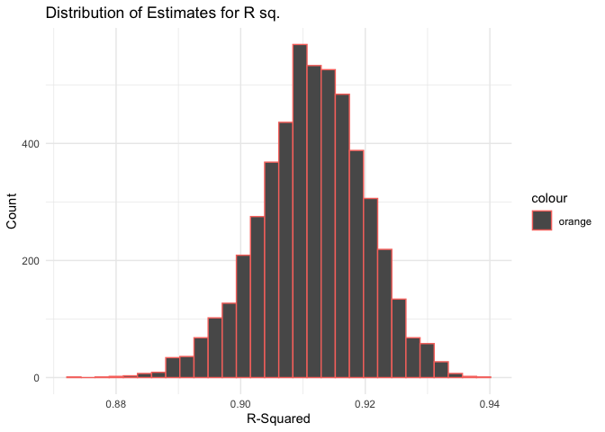

hw6\_jo2570
================
Jai Oberoi
20/11/2019

Load and clean birthweight data:

``` r
bw_data = read_csv("./data/birthweight.csv") %>% 
  janitor::clean_names() %>%
  mutate(babysex = factor(babysex, levels = c("1", "2"), labels = c("male", "female")),
         frace = factor(frace, levels = c("1", "2", "3", "4", "8", "9"), labels = c("white", "black", "asian", "puerto rican", "other", "unknown")),
         malform = factor(malform, levels = c("0", "1"), labels = c("absent", "present")),
         mrace = factor(mrace, levels = c("1", "2", "3", "4", "8"), labels = c("white", "black", "asian", "puerto rican", "other"))
         )
```

    ## Parsed with column specification:
    ## cols(
    ##   .default = col_double()
    ## )

    ## See spec(...) for full column specifications.

Checking for missing data:

``` r
filter_all(
  bw_data, any_vars(is.na(.))
)
```

    ## # A tibble: 0 x 20
    ## # … with 20 variables: babysex <fct>, bhead <dbl>, blength <dbl>,
    ## #   bwt <dbl>, delwt <dbl>, fincome <dbl>, frace <fct>, gaweeks <dbl>,
    ## #   malform <fct>, menarche <dbl>, mheight <dbl>, momage <dbl>,
    ## #   mrace <fct>, parity <dbl>, pnumlbw <dbl>, pnumsga <dbl>, ppbmi <dbl>,
    ## #   ppwt <dbl>, smoken <dbl>, wtgain <dbl>

No missing values are present.

Fitting a regression model for birthweight:

We fit a regression model for baby birthweight using the hypothesis that
test how characteristics of the baby affect its birthweight. We fit a
model with the main predictors being baby characteristics and adjust for
some mother characteristics thay may affect her health and health of the
baby. We want to keep the model parsimonious, ensure no 2 predictor
variables measure the same characteristic and/or are very closely
associated with each
other.

``` r
fit = lm(bwt ~ babysex + bhead + blength + gaweeks + momage + ppbmi + smoken + malform, data = bw_data) 

fit %>% 
  broom::tidy() %>% 
  knitr::kable()
```

| term           |      estimate |   std.error |    statistic |   p.value |
| :------------- | ------------: | ----------: | -----------: | --------: |
| (Intercept)    | \-6344.712154 | 100.4278929 | \-63.1767925 | 0.0000000 |
| babysexfemale  |     33.262268 |   8.8109456 |    3.7751076 | 0.0001621 |
| bhead          |    138.989868 |   3.5613022 |   39.0278218 | 0.0000000 |
| blength        |     81.252337 |   2.0750891 |   39.1560712 | 0.0000000 |
| gaweeks        |     13.839031 |   1.5144980 |    9.1377014 | 0.0000000 |
| momage         |      6.042356 |   1.1299092 |    5.3476477 | 0.0000001 |
| ppbmi          |      2.942857 |   1.3657462 |    2.1547610 | 0.0312355 |
| smoken         |    \-2.038317 |   0.5879926 |  \-3.4665692 | 0.0005323 |
| malformpresent |     44.464140 |  73.6171671 |    0.6039915 | 0.5458809 |

``` r
fit %>% 
  broom::glance() %>% 
  knitr::kable()
```

| r.squared | adj.r.squared |    sigma | statistic | p.value | df |     logLik |      AIC |     BIC |  deviance | df.residual |
| --------: | ------------: | -------: | --------: | ------: | -: | ---------: | -------: | ------: | --------: | ----------: |
| 0.6922811 |      0.691713 | 284.3664 |  1218.504 |       0 |  9 | \-30689.97 | 61399.94 | 61463.7 | 350384805 |        4333 |

For the inclusion criteria for the final model, we recognize variables
that meet the 95% level of significance (p-value \< 0.05). We exclude
malform from the final
model.

``` r
fit_final = lm(bwt ~ babysex + bhead + blength + gaweeks + momage + ppbmi + smoken, data = bw_data) 

fit_final %>% 
  broom::tidy() %>% 
  knitr::kable()
```

| term          |      estimate |   std.error |   statistic |   p.value |
| :------------ | ------------: | ----------: | ----------: | --------: |
| (Intercept)   | \-6344.488419 | 100.4198501 | \-63.179625 | 0.0000000 |
| babysexfemale |     33.179198 |   8.8092265 |    3.766414 | 0.0001678 |
| bhead         |    139.010339 |   3.5608799 |   39.038199 | 0.0000000 |
| blength       |     81.237674 |   2.0747950 |   39.154554 | 0.0000000 |
| gaweeks       |     13.833273 |   1.5143570 |    9.134750 | 0.0000000 |
| momage        |      6.052783 |   1.1296945 |    5.357893 | 0.0000001 |
| ppbmi         |      2.941943 |   1.3656453 |    2.154251 | 0.0312754 |
| smoken        |    \-2.027225 |   0.5876627 |  \-3.449640 | 0.0005667 |

``` r
fit_final %>% 
  broom::glance() %>% 
  knitr::kable()
```

| r.squared | adj.r.squared |    sigma | statistic | p.value | df |     logLik |      AIC |      BIC |  deviance | df.residual |
| --------: | ------------: | -------: | --------: | ------: | -: | ---------: | -------: | -------: | --------: | ----------: |
| 0.6922552 |     0.6917581 | 284.3456 |  1392.728 |       0 |  8 | \-30690.15 | 61398.31 | 61455.69 | 350414305 |        4334 |

Plotting residuals agaist predticted values based on the model
fit\_final:

``` r
bw_data %>% 
  modelr::add_residuals(fit_final) %>% 
  modelr::add_predictions(fit_final) %>% 
  ggplot(aes(x = pred , y = resid)) + 
  geom_point(alpha = 0.5, color = "blue") + geom_hline(yintercept = 0, color = "red") + 
  labs(title = "Residuals by Predicted Value of Birthweight", 
       x = "Predicted birthweight (grams)", 
       y = "Residuals") + 
  theme_set(theme_minimal() + theme())
```

<!-- -->

Comparing models:

Creating model 1:

``` r
fit_1 = lm(bwt ~ blength + gaweeks, data = bw_data)

fit_1 %>% 
  broom::tidy() %>% 
  knitr::kable()
```

| term        |     estimate | std.error |  statistic | p.value |
| :---------- | -----------: | --------: | ---------: | ------: |
| (Intercept) | \-4347.66707 | 97.958360 | \-44.38281 |       0 |
| blength     |    128.55569 |  1.989891 |   64.60439 |       0 |
| gaweeks     |     27.04673 |  1.717930 |   15.74379 |       0 |

``` r
fit_1 %>% 
  broom::glance() %>%  
  knitr::kable()
```

| r.squared | adj.r.squared |    sigma | statistic | p.value | df |     logLik |      AIC |      BIC |  deviance | df.residual |
| --------: | ------------: | -------: | --------: | ------: | -: | ---------: | -------: | -------: | --------: | ----------: |
| 0.5768894 |     0.5766943 | 333.2174 |  2958.001 |       0 |  3 | \-31381.32 | 62770.64 | 62796.14 | 481775846 |        4339 |

Creatiing model
2:

``` r
fit_2 = lm( bwt ~ babysex + bhead + blength + babysex*bhead + babysex*blength + bhead*blength + babysex*bhead*blength, data = bw_data)

fit_2 %>% 
  broom::tidy() %>%  
  knitr::kable()
```

| term                        |       estimate |    std.error |   statistic |   p.value |
| :-------------------------- | -------------: | -----------: | ----------: | --------: |
| (Intercept)                 | \-7176.8170221 | 1264.8397394 | \-5.6740920 | 0.0000000 |
| babysexfemale               |   6374.8683508 | 1677.7669213 |   3.7996150 | 0.0001469 |
| bhead                       |    181.7956350 |   38.0542051 |   4.7772811 | 0.0000018 |
| blength                     |    102.1269235 |   26.2118095 |   3.8962180 | 0.0000992 |
| babysexfemale:bhead         |  \-198.3931810 |   51.0916850 | \-3.8830816 | 0.0001047 |
| babysexfemale:blength       |  \-123.7728875 |   35.1185360 | \-3.5244319 | 0.0004288 |
| bhead:blength               |    \-0.5536096 |    0.7802092 | \-0.7095656 | 0.4780117 |
| babysexfemale:bhead:blength |      3.8780531 |    1.0566296 |   3.6702106 | 0.0002453 |

``` r
fit_2 %>% 
  broom::glance() %>% 
  knitr::kable()
```

| r.squared | adj.r.squared |    sigma | statistic | p.value | df |    logLik |      AIC |      BIC |  deviance | df.residual |
| --------: | ------------: | -------: | --------: | ------: | -: | --------: | -------: | -------: | --------: | ----------: |
|  0.684876 |      0.684367 | 287.7344 |  1345.616 |       0 |  8 | \-30741.6 | 61501.19 | 61558.58 | 358816655 |        4334 |

Cross validation:

``` r
cv_df = 
  crossv_mc(bw_data, 100) %>% 
  mutate(train = map(train, as_tibble),
         test = map(test, as_tibble)
         ) %>% 
  mutate(fit_final = map(train, ~lm(bwt ~ babysex + bhead + blength + gaweeks + momage + ppbmi + smoken, data = .x)), 
         fit_1 = map(train, ~lm(bwt ~ blength + gaweeks, data = .x)),
         fit_2 = map(train, ~lm( bwt ~ babysex + bhead + blength + babysex*bhead + babysex*blength + bhead*blength + babysex*bhead*blength, data = .x))) %>%
  mutate(rmse_1 = map2_dbl(fit_final, test, ~rmse(model = .x, data = .y)),
         rmse_2 = map2_dbl(fit_1, test, ~rmse(model = .x, data = .y)),
         rmse_3 = map2_dbl(fit_2, test, ~rmse(model = .x, data = .y)))

cv_df %>% 
  select(starts_with("rmse")) %>% 
  pivot_longer(
    everything(),
    names_to = "model", 
    values_to = "rmse",
    names_prefix = "rmse_") %>% 
  mutate(model = fct_inorder(model)) %>% 
  ggplot(aes(x = model, y = rmse, fill = model, alpha = 0.5)) + geom_violin() +
    labs(
    title = "Comparing Models",
    x = "Model",
    y = "Root Mean Sq. Error"
   )
```

<!-- -->

From the violin plot above we see that model fit\_final (model 1) has
smallest root mean standard error and is thus the best model for
predicting birthweight in this dataset.

Problem 2:

Import and clean datset:

``` r
weather_df = 
  rnoaa::meteo_pull_monitors(
    c("USW00094728"),
    var = c("PRCP", "TMIN", "TMAX"), 
    date_min = "2017-01-01",
    date_max = "2017-12-31") %>%
  mutate(
    name = recode(id, USW00094728 = "CentralPark_NY"),
    tmin = tmin / 10,
    tmax = tmax / 10) %>%
  select(name, id, everything())
```

    ## Registered S3 method overwritten by 'crul':
    ##   method                 from
    ##   as.character.form_file httr

    ## Registered S3 method overwritten by 'hoardr':
    ##   method           from
    ##   print.cache_info httr

    ## file path:          /Users/Jai/Library/Caches/rnoaa/ghcnd/USW00094728.dly

    ## file last updated:  2019-09-26 10:01:48

    ## file min/max dates: 1869-01-01 / 2019-09-30

Generating 5000 bootstrap samples:

``` r
boot_sample = function(df) {
  sample_frac(df, replace = TRUE)
}

boot_straps = 
  tibble(
    strap_number = 1:5000,
    strap_sample = rerun(5000, boot_sample(weather_df))
  )
```

Estimating Log(B0\*B1):

``` r
bootstrap_results =
  boot_straps %>% 
  mutate(
    models = map(strap_sample, ~lm(tmax ~ tmin, data=.x)),
    results = map(models, broom::tidy)) %>% 
  select(-strap_sample, -models) %>% 
  unnest(cols = c(results)) %>% 
  select(strap_number, term, estimate) %>% 
  pivot_wider(
    names_from = "term",
    values_from = "estimate"
  ) %>% 
  janitor::clean_names() %>% 
  mutate(log = log(intercept*tmin)) %>% 
  select(strap_number, log)

bootstrap_results
```

    ## # A tibble: 5,000 x 2
    ##    strap_number   log
    ##           <int> <dbl>
    ##  1            1  2.02
    ##  2            2  2.04
    ##  3            3  2.02
    ##  4            4  2.01
    ##  5            5  1.97
    ##  6            6  2.02
    ##  7            7  2.01
    ##  8            8  2.02
    ##  9            9  2.01
    ## 10           10  2.00
    ## # … with 4,990 more rows

Estimating R sq. :

``` r
bootstrap_results_2 =
  boot_straps %>% 
  mutate(
    models = map(strap_sample, ~lm(tmax ~ tmin, data=.x)),
    results = map(models, broom::glance)) %>% 
  select(-strap_sample, -models) %>% 
  unnest(cols = c(results)) %>% 
  select(strap_number, r.squared, adj.r.squared)

bootstrap_results_2
```

    ## # A tibble: 5,000 x 3
    ##    strap_number r.squared adj.r.squared
    ##           <int>     <dbl>         <dbl>
    ##  1            1     0.914         0.914
    ##  2            2     0.916         0.916
    ##  3            3     0.913         0.913
    ##  4            4     0.913         0.912
    ##  5            5     0.914         0.913
    ##  6            6     0.896         0.896
    ##  7            7     0.905         0.905
    ##  8            8     0.904         0.903
    ##  9            9     0.915         0.915
    ## 10           10     0.916         0.916
    ## # … with 4,990 more rows

PLotting the distribution of log(B0\*B1) and R-Squared estimates:

``` r
plot_1 =
  ggplot(
    data = bootstrap_results, 
    aes(x = log, color = "orange")) +
  geom_histogram() + 
  labs(
    title = "Distribution of Estimates for Log(B0*B1)",
    x = "Log B0*B1",
    y = "Count"
    ) 

plot_1
```

    ## `stat_bin()` using `bins = 30`. Pick better value with `binwidth`.

<!-- -->

``` r
plot_2 = 
  ggplot(data = bootstrap_results_2, 
         aes(x = r.squared, color = "orange")) + 
  geom_histogram() + 
  labs(
    title = "Distribution of Estimates for R sq.",
    x = "R-Squared",
    y = "Count"
    ) 

plot_2
```

    ## `stat_bin()` using `bins = 30`. Pick better value with `binwidth`.

<!-- -->

According to the plots above it appears the distrubution of both
log(B0\*B1) and R-Squared estimates are aproximately normal.

Identifing the 2.5% and 97.5% quantiles to provide a 95% confidence
interval for log(B0\*B1) and R-Squared estimates:

``` r
bootstrap_results %>% 
  pull(log) %>% 
quantile(., probs = c(0.025, 0.975), na.rm = TRUE)
```

    ##     2.5%    97.5% 
    ## 1.965549 2.057890

``` r
bootstrap_results_2 %>% 
  pull(r.squared) %>% 
quantile(., probs = c(0.025, 0.975), na.rm = TRUE)
```

    ##      2.5%     97.5% 
    ## 0.8937095 0.9275335

The 95% CI for log(b0\*b1) = (1.966, 2.059) and the 95% confidence
interval for R-squared = (0.894, 0.927)
